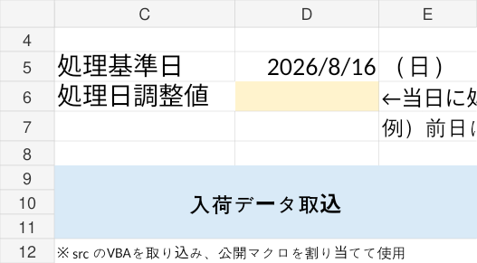
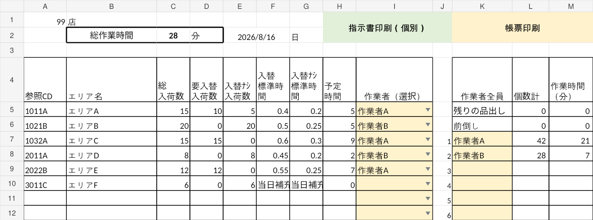
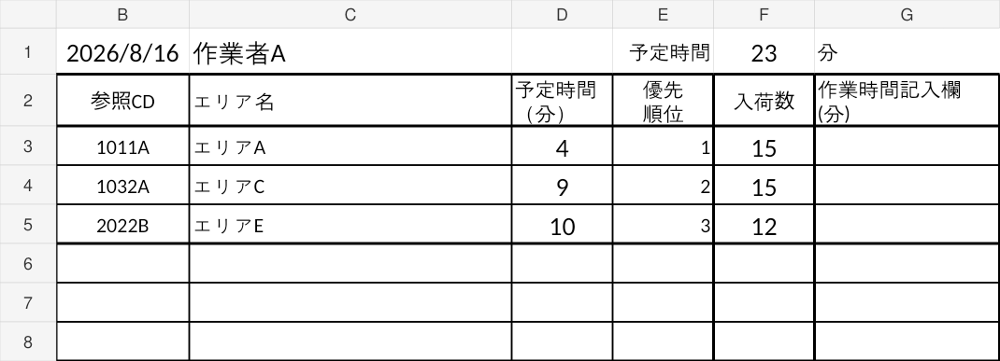

# Operation Chart VBA Sample

Excel VBAで、外部データの取込からマスタ照合、作業割当、個人別指示書・作業編成表の作成までを行うサンプルです。

実務で使用した業務ツールの構成をベースに、GitHub公開用としてデータ・名称を匿名化したものです。会社名、店舗名、実際の商品コード、従業員名、数量などの実データは含みません。

## 主な機能

- 外部Excelファイルの取込
- 納品日の確認
- 参照CDの自動生成
- エリアマスタとの照合
- 参照CDの重複排除・昇順化
- 商品件数に応じた作業編成画面の更新
- 入力規則を利用した作業者割当
- 個人別指示書の作成・印刷
- 作業編成表の印刷
- シート保護を考慮した更新処理
- エラー時の中止・既存データ保護
- Excel 2019 / 2024を考慮した実装

## 処理の流れ

```text
外部データ
   ↓
データ取込
   ↓
日付確認
   ↓
参照CD生成
   ↓
エリアマスタ照合
   ↓
作業編成画面更新
   ↓
担当者設定
   ↓
個人別指示書 / 作業編成表
```

## フォルダ構成

```text
operation-chart-vba-sample/
├─ README.md
├─ LICENSE
├─ .gitignore
├─ .gitattributes
├─ src/
│  ├─ M00_Constants.bas
│  ├─ M01_Main.bas
│  ├─ M02_ExternalData.bas
│  ├─ M03_DateLogic.bas
│  ├─ M04_ReferenceCode.bas
│  ├─ M05_ReportUpdate.bas
│  ├─ M06_InstructionPrint.bas
│  ├─ M07_WorkAssignmentPrint.bas
│  ├─ M08_Protection.bas
│  ├─ M90_Common.bas
│  └─ ThisWorkbook.cls
├─ sample/
│  ├─ OperationChart_Sample.xlsm
│  ├─ SEND_SAMPLE.xlsx
│  └─ SEND3_SAMPLE.xlsx
├─ docs/
│  ├─ specification.md
│  ├─ module_overview.md
│  └─ user_manual.pdf
└─ screenshots/
   ├─ main_screen.png
   ├─ work_assignment.png
   └─ instruction_sheet.png
```


## 画面イメージ

### MF



### 作業編成画面



### 指示書



## サンプルデータ

作業者は `作業者A`、`作業者B` の2名です。商品・棚・エリア・数量はすべて架空の値です。

参照CDは、実装と同じ規則で生成します。

```text
参照CD = 棚1 × 100 + 棚2 + エリアコード
```

例：

```text
棚1 = 01
棚2 = 02
エリア = 1B
→ 1021B
```

## 動作環境

- Windows
- Microsoft Excel デスクトップ版
- Excel 2019 / Excel 2024を想定
- マクロを有効にできる環境

## セットアップ

`OperationChart_Sample.xlsm` は公開用テンプレートです。GitHub上でVBAコードを確認・差分管理できるよう、VBAソースは `src/` に分離しています。`.bas` / `.cls` はExcelへの取り込みを考慮してCP932で保存し、`.gitattributes` の `working-tree-encoding` でGitHub上ではUTF-8として扱える構成にしています。

1. `OperationChart_Sample.xlsm` と `SEND_SAMPLE.xlsx`、`SEND3_SAMPLE.xlsx` を同じフォルダに置きます。
2. Excelで `OperationChart_Sample.xlsm` を開きます。
3. VBAエディタで `src/` の `.bas` ファイルをインポートします。
4. `ThisWorkbook.cls` の `Workbook_Open` の内容を、ブックの `ThisWorkbook` モジュールへ反映します。
5. 次の公開マクロを実行します。
   - `ImportReceivingData`
   - `PrintIndividualInstructions`
   - `PrintWorkAssignmentSheet`

サンプルブック内のフォームボタンは、上記3マクロへの割当を想定しています。

> 注: この配布パッケージ自体にはコンパイル済みVBAプロジェクトを埋め込んでいません。VBAソースをGitHubでレビューしやすい形にするため、コードをテキストファイルとして分離しています。

## 日付について

`SEND_SAMPLE.xlsx` は当日、`SEND3_SAMPLE.xlsx` はVBAの次回納品日判定と同じ規則になるよう日付を数式で設定しています。通常は日付調整値を空白のまま実行してください。

水曜日は納品がありません。当日または次回予定日に水曜日が含まれる場合、対象データが取り込まれないことがありますが、異常ではありません。

## 公開用に変更した点

- 実際の作業者名 → `作業者A`、`作業者B`
- 店舗コード・商品情報・数量 → 架空値
- エリア名 → `エリアA` などの架空名
- 外部サンプルファイル → GitHubで扱いやすい `.xlsx`
- VBAのモジュール名・プロシージャ名 → 英字化
- 実データ、会社名、社内パス等はすべて除外

シート名は実運用版の構成を示すため、日本語名を維持しています。

## 注意

本リポジトリは業務自動化の設計・実装例を示すサンプルです。実運用へ転用する場合は、データ列、マスタ構成、印刷設定、保護設定等を利用環境に合わせて確認してください。
